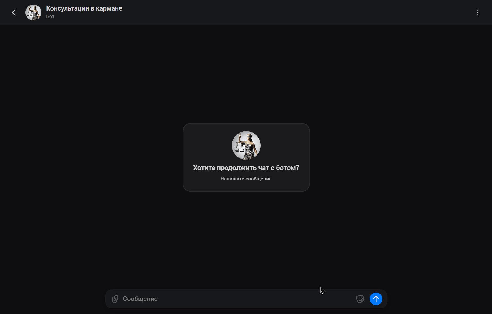

# MAX Python Bot

<div align="center">


**Современный асинхронный бот для платформы MAX на Python**  
Легкая стартовая база для разработки, тестирования и дальнейшего масштабирования.

</div>

---

## Демонстрация

<p align="center">
  
</p>


---

## О проекте

**MAX Python Bot** — это пробный, но уже полноценно оформленный проект бота для платформы **MAX**, написанный на **Python** с использованием асинхронного подхода.

Проект задуман как удобная и чистая база, которую можно использовать:

- для изучения разработки ботов под MAX;
- для быстрого старта нового проекта;
- для создания MVP;
- для дальнейшего наращивания логики, команд, сценариев и интеграций.

---

## Ключевые особенности

- асинхронная архитектура;
- понятная структура проекта;
- разделение логики по модулям;
- готовность к добавлению новых обработчиков;
- поддержка конфигурации через `.env`;
- удобная база для локального запуска и серверного деплоя.

---

## Стек технологий

| Технология | Назначение |
|---|---|
| **Python 3** | основной язык разработки |
| **asyncio** | асинхронное выполнение |
| **HTTP API** | взаимодействие с платформой MAX |
| **.env / переменные окружения** | конфигурация проекта |
| **venv** | изоляция зависимостей |

---

## Структура проекта

```bash
max_python_bot/
├── app/
│   ├── handlers/          # обработчики команд и событий
│   ├── services/          # бизнес-логика
│   ├── core/              # конфигурация и общие модули
│   ├── api/               # работа с API MAX
│   └── main.py            # точка входа
├── assets/                # изображения, gif, медиа для README
├── .env                   # переменные окружения
├── requirements.txt       # зависимости
├── README.md
└── .gitignore
```

---

## Как это работает

1. Приложение запускается через основной модуль.
2. Загружаются настройки и переменные окружения.
3. Бот подключается к API платформы MAX.
4. Начинается обработка входящих событий.
5. Сообщения направляются в соответствующие обработчики.
6. Формируется и отправляется ответ пользователю.

---

## Быстрый старт

### 1. Клонирование репозитория

```bash
git clone https://github.com/Polen452294/MAX-Python-Bot.git
cd max_python_bot
```

### 2. Создание виртуального окружения

**Windows**
```bash
python -m venv .venv
.venv\Scripts\activate
```

**Linux / macOS**
```bash
python3 -m venv .venv
source .venv/bin/activate
```

### 3. Установка зависимостей

```bash
pip install -r requirements.txt
```

### 4. Настройка `.env`

Создай файл `.env` и укажи нужные параметры.

Пример:

```env
BOT_TOKEN=your_token_here
API_BASE_URL=your_api_url_here
```

### 5. Запуск проекта

```bash
python -m app.main
```

Если точка входа другая:

```bash
python main.py
```

---

## Конфигурация

Все чувствительные данные лучше хранить в `.env`:

- токены;
- URL API;
- служебные настройки;
- параметры окружения.

Это делает проект безопаснее и удобнее для переноса между локальной и серверной средой.

---

## Где использовать этого бота

Проект может быть основой для:

- бота-автоответчика;
- сервисного помощника;
- командного бота;
- интеграции с внешними API;
- системы уведомлений;
- MVP под дальнейшее развитие.

---

## Безопасность

Рекомендуется:

- не коммитить `.env` в репозиторий;
- не хранить токены в коде;
- использовать разные настройки для dev/prod;
- ограничивать доступ к чувствительным данным.

---

## Пример `.gitignore`

```gitignore
.venv/
__pycache__/
.env
*.pyc
.idea/
.vscode/
```

---

## Автор

**Aleandr Ardashev**


## Автор

**Aleandr Ardashev**

- GitHub: [Polen452294](https://github.com/Polen452294)
- Telegram: [@likeaatea](https://t.me/likeaatea)
- Website: [ardashevdev.ru](https://ardashevdev.ru/)

---

## Лицензия

Проект распространяется по лицензии **MIT**.  
Полный текст лицензии находится в файле [LICENSE](./LICENSE).